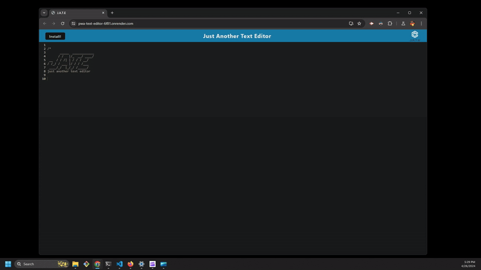

  # JATE PWA Text Editor

  

  ## Description

  [Link to application](https://pwa-text-editor-6f81.onrender.com/)

  This is a simple text editor that follows Progressive Web App (PWA) criteria. A PWA is a type of web application offers features such as offline access, push notifications, and the ability to install on users' devices.

  ## Table of Contents

  - [Installation](#installation)
  - [Usage](#usage)
  - [Credits](#credits)
  - [License](#license)

  ## Installation

  Follow this [Link](https://pwa-text-editor-6f81.onrender.com/) to begin using in your web browswer. You may also install the application locally after navigating to that page by clicking the "install" button in the top left corner of the page.

  ## Usage
  
  After using the method described above to begin using the application, simply start typing any text you wish to save. This application can be used in a web broser or as a standalone app, whether you are connected to the internet or not.

  
  
  ## Credits 

  My wife for putting up with me while I continue my journey in full stack web development

  ## License

  Unlicense 

  Click the badge for further information

  

  ## Questions
  
  For any further questions, please contact davesalter1988@gmail.com, and visit https://github.com/DaveSalterM for additional projects